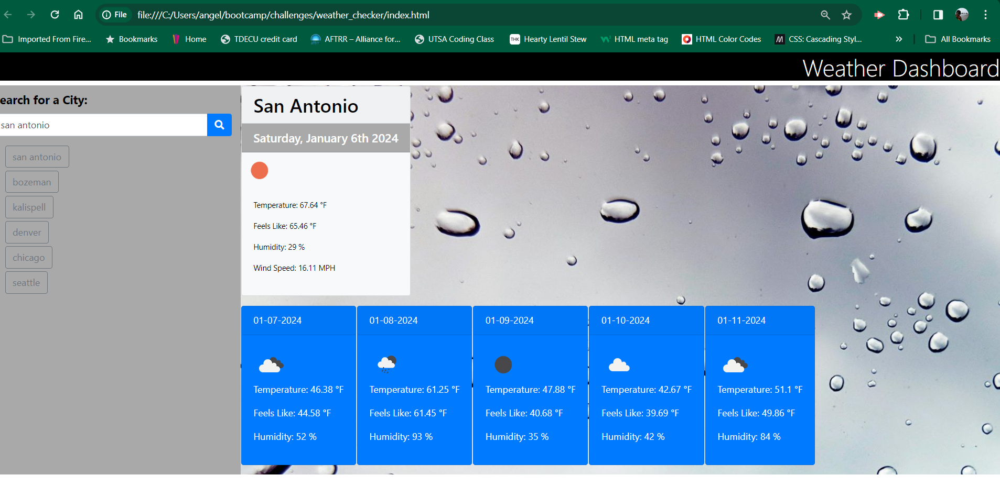

# weather_checker
Use the 5 Day Weather Forecast to retrieve weather data for cities. 

## User Story

```
AS A traveler
I WANT to see the weather outlook for multiple cities
SO THAT I can plan a trip accordingly
```

## Acceptance Criteria

```
GIVEN a weather dashboard with form inputs
WHEN I search for a city
THEN I am presented with current and future conditions for that city and that city is added to the search history
WHEN I view current weather conditions for that city
THEN I am presented with the city name, the date, an icon representation of weather conditions, the temperature, the humidity, and the wind speed
WHEN I view future weather conditions for that city
THEN I am presented with a 5-day forecast that displays the date, an icon representation of weather conditions, the temperature, the wind speed, and the humidity
WHEN I click on a city in the search history
THEN I am again presented with current and future conditions for that city
```

## Mock-Up

The following image shows the web application's appearance and functionality:



The weather app includes a search option, a list of cities, and a five-day forecast and current weather conditions for Atlanta.

## Sources/ Citation and assistance

https://getbootstrap.com/docs/4.0/components/card/
https://developer.mozilla.org/en-US/docs/Learn/Server-side/First_steps/Introduction
https://developer.mozilla.org/en-US/docs/Web/API/Fetch_API

Worked with Tutor Andrew Hardemon to cover APIs and CSS styling. 


